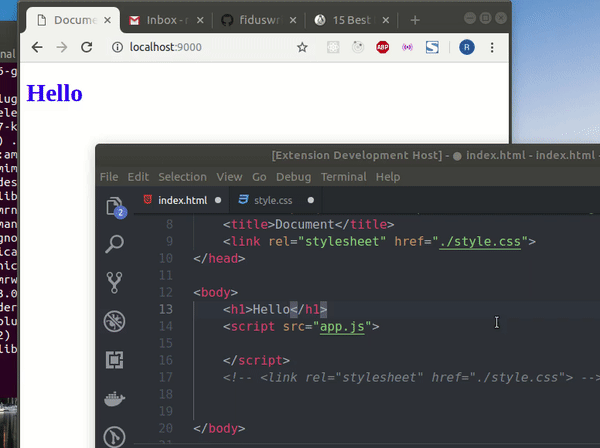

  

<h3 align="center">Vscode Live Server++ (BETA) </h3>

It's Truly Live

    

---

---
## Features

- **No Need to save HTML, CSS, JS** :smile:
- **No Browser full reload** (for HTML & CSS)
- Customizable Server Root
- Customizable Server Port
- Customizable reloading time
- Customizable index file (e.g `index.html`)
- Auto Browser open (Mozila, Chrome & Edge)
- Control from statusbar

---

## Downside

- `Live Server++` will work well if your project only contents `css` & `html` and minimal `JavaScript`. If you do lot of DOM Manupulation with JavaScript, `Live Server++` is not recommended.

--- 
## How to Start/Stop Server ?

1. Open a project and click to `Go Live++` from the status bar to turn the server on/off.

2. Open the Command Pallete by pressing `F1` or `ctrl+shift+P` and type `Live Server++: Open Server` to start a server or type `Live Server++: Close Server` to stop a server.

---

## Settings

[Click here to read settings Docs](./docs/settings.md).

## What's new ?

- ### v0.0.1 (##DATE##)
  - Initial release
  - hot Reload supported
  - No need to save
  - 5 settings are added (Port, Root, indexFile, timeout, browser)

---

## Changelog

To check full changelog [click here](CHANGELOG.md).

---

## Why `Live Server++` when there is a `Live Server` ?

Actually, I was receiving a lot of emails, PR, comments (and also there was few issue request, e.g. [#12080](https://github.com/Microsoft/vscode/issues/12080)) - `why auto reload only happens when we save the file`? - `why it's not realtime?`... blah blah....

Well, in Live Server Extension, I'm using a popular npm module (named `live-server`) and it's the core library of Live Server. _(yaa! too many "Live Server" 😜)_. In the way it's working - it never possible auto reload without saving the file.

And yaa, to be honest, when I made (in mid of `2017`) the live server extension, I didn't know Node.js or JavaScript well _(Hold on! I still don't know `Node.js` but I'm now confident)_. I even didn't know `promise`/`callback` well. I understood the `callback` _(& `callback hell` too)_ while making the extension. And `Promise`? Only I knew how to use it like `.then().then().then()` and `IIFE`? or `closure`? - I didn't even hear about those names at that time. 😬

Okay, now coming to the point, Code of the `Live Server` can't be migrated with `Live Server++`. `Live Server++` is not depended on `live-server`(the npm module) - I've written the server side code from scratch & it has minimal dependency (still under development).

---

## LICENSE

This extension is licensed under the [MIT License](LICENSE)
